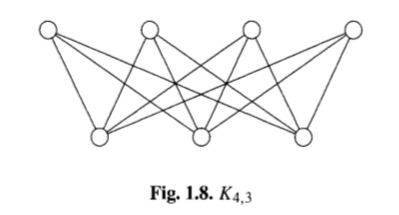
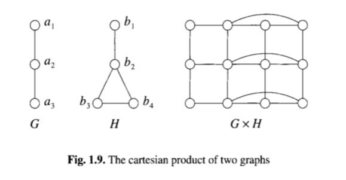

# Graphs

## 1.1 Sets, Binary Relations and Graphs

本节主要讲解了一些集合的基本概念。比如并集`unoin`，交集`intersaction`。然后是证明集合相等的两种方法:

> 两者元素相等，或者A是B的子集的同时B也是A的子集 
> To prove that two sets are equal, one often proves that every member of one set is an element of the other, and conversely. In other words, to show that A = B, first prove $A \subseteq B$ and then prove$ A \supseteq B$.

之后讲了二元关系`~`。反身关系 `reflexive` 对所有$x \sim x$成立。反反身关系 `antireflexive` 则对$x\sim x$不成立。还有对称关系` symmetric `对所有$x \sim y , y \sim x$同时成立，非对称关系则与之相反。

集合加上二元关系可以构成一张图。集合的元素就是图中的顶点 `vertices` 而二元关系则构成图中的边 `edge` 对称关系图可以用无向图表示，否则应该用有向图。

## 1.2 Some Definitions

图的顶点数叫`order`，边数叫`size`，写作$V(G)$ 和 $E(G)$ 如果 A,B 是 V(G)的子集, 那样可以用[A, B]表示一个顶点分别在 A B 中边属于$E(G)$ 的图。

- 同构(isomorphism): 存在一个变换$\phi$是将$V(G)$ 一一映射到 $V(H)$，同时保证$E(G)$ 正好映射到 $E(H)$，G 和 G 本身自同构。

- 完全图(complete graph): 对于n个顶点，两两之间都有边相连的图叫完全图。写作$K_n$。任意n个顶点的完全图，两两之间都同构。

- 多重图(MultiGraph): 有平行变的图

- 有向图,无向图, 连接矩阵: （略）

- 连接(adjacent), 邻居(neighbour), 领域(neighbourhood): 有边连接的顶点。

- 边的连接(adjacent): 共有顶点的边。

- 关联(incident): 边与端点的关系。

- 独立(independent), 独立数(independence number): 前者表示一组顶点或者边，两两互不连接，后者表示一个图中最多两两互不连接的顶点数。

- 关联矩阵(incident matrix): 类似连接矩阵，但是横竖坐标变成了边和点，而不是点和点。

- 子图(subgraph), 真子图(proper subgraph): 略

- 诱导子图(induced subgraph): 选取图G的部分顶点，保留图G涉及这些顶点全部的边得到的图。写作$(U)$ 或者 $G[U]$。

- 团(clique), 最大团(maximal clique), 团数(clique number): 团是个完全图的子图。最大团是没有其他顶点和团中每个顶点相连的团，团数是G 中最大团的顶点数。 

- 团图(clique graph): 顶点是最大团，如果两个团共有顶点则用边连接形成的团。

- 补图(complement graph), 空图(null graph): 完全图减去当前图得到的图是当前图的补图写作$\hat G$。从图H 中 减去子图G所有的边也可以叫做G在H中的补图，完全图的补图是空图。

- 连接(connected)，断开(disconnected)：断开指的图的两个顶点子集互相之间互相没有边相连。

- 连通子图(component): 断开图会有很多连通子图构成。

- xy路径(xy-walk): 从x 沿着 $x_1$, $x_2$, $x_3$, ... $x_n$, $y$。

- 完全二部图(complete bipartite graph): 两组顶点，内部互不相连，但是互相之间两两相连，比如神经网络中两个全连接层之间。可以用$K\_{m,n}$表示 

- 图的交集(union)和并集(intersaction): 顶点和边的交集和并集。同一个顶点集合上的图交集又叫做和(sum)

- 图的(join): 将两个图的顶点互相连接。

- 图的(production)：笛卡尔积。

## 1.3 Degree

- 度(degree): 顶点相连的边数。

- 孤立点(isolated) 吊点(pendant): 孤立点没有边的顶点, 吊点只有条边的点.

- 正则图(regular graph): 所有顶点都有相同的度的图，如果这个度是r，就叫 r-正则,3正则又叫立方(cubic)。$\delta(G)$可以表示图G中最小的度，$\Delta(G)$可以表示图G中最大的度。

##### 定理1.1: 所有节点度和和等于边数的两倍。

##### 推论1.1: 任何图中度为奇数的顶点数量都是偶数。

- 图解的(graphical): 一个整数集合，满足它们可以成为一个图的度的集合。如果这个图是一个连接图，则这是一个。

##### 定义1.2: 集合$$S=\begin{Bmatrix} d_0,d_1,...,d\_{v-1} \end{Bmatrix} $$，有v个整数满足$$d_0 \geq d_1 \geq d_2 \geq ... \geq d\_{v-1} $$ 而且$$d_0 \geq 1, v \geq 2$$ 是图解的当且仅当 $$s^" = \begin{Bmatrix} d_1 - 1,...,d\_{d_0 - 1} , d\_{d\_0 + 1},d\_{v-1} \end{Bmatrix} 是图解的$$

证明：通过将边移动可以得到这个结论，相当于将第一个以及它连接的$d_0$条边一起移除。此定理不光可以告诉我们一个序列是否可以图解，而且可以帮我们找到符合要求的图。
